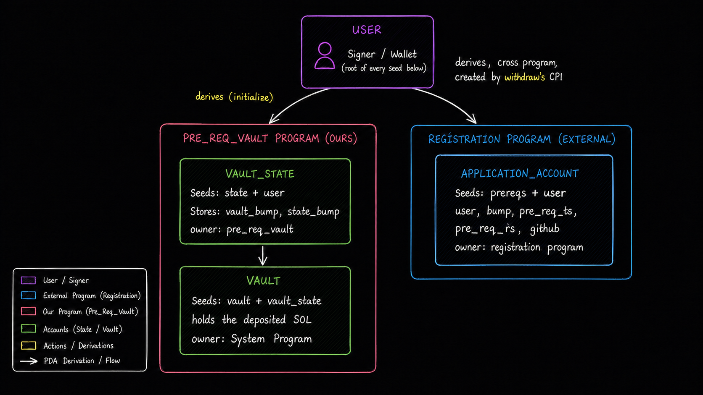
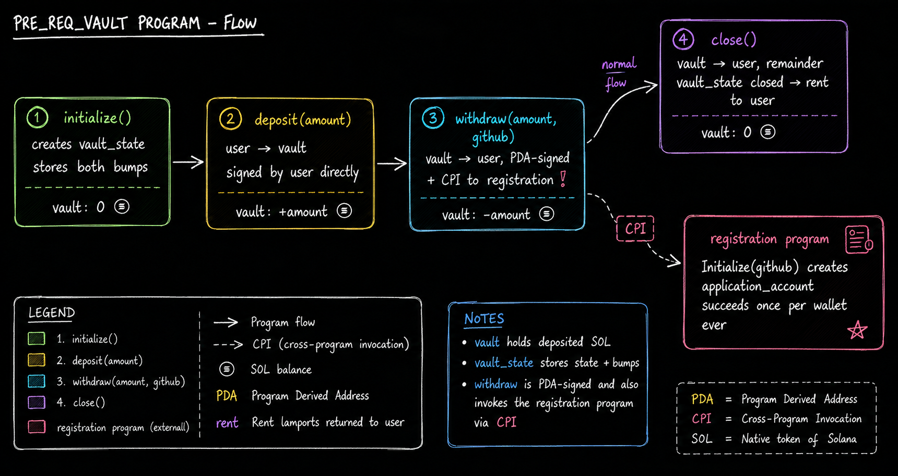

# pre_req_vault

A per-user SOL vault built with Anchor on Solana devnet. Every account is a PDA derived
from your wallet; the one instruction that isn't a plain transfer — `withdraw` — also
reaches out to a second, external program to register you as part of a prerequisites
challenge.

|                   |                                                  |
| ----------------- | ------------------------------------------------ |
| Program           | `pre_req_vault`                                  |
| Framework         | Anchor                                           |
| Cluster           | devnet                                           |
| Program ID        | `HU6trJMgjL2m5AL4jVmtfj3N7ay8UxezQDr624BKrqeP`   |
| Deployment wallet | `~/.config/solana/id.json`                       |
| Instructions      | 4 — `initialize`, `deposit`, `withdraw`, `close` |
| Accounts touched  | 6                                                |

## Accounts at a glance

Everything below is a PDA except the wallet itself and the two programs. Seeds are shown in
plain form — `state + user` means the real seed list is `[b"state", user.key()]`.

| Account                                        | Derived from (seeds)                                                   | Holds                                        | Owned by             |
| ---------------------------------------------- | ---------------------------------------------------------------------- | -------------------------------------------- | -------------------- |
| `user` — Signer                                | — (root of every derivation)                                           | the wallet's own SOL; pays rent & fees       | System Program       |
| `vault_state` — `Account<VaultState>`          | `state + user`                                                         | `vault_bump: u8`, `state_bump: u8`           | `pre_req_vault`      |
| `vault` — `SystemAccount`                      | `vault + vault_state`                                                  | the deposited SOL — no other data            | System Program       |
| `application_account` — opaque to us           | `prereqs + user` (seeded under the **registration** program, not ours) | `user, bump, pre_req_ts, pre_req_rs, github` | registration program |
| `application_program` — `Program<Q3PreReqsRs>` | — (fixed external address)                                             | the executable this program CPIs into        | itself               |
| `system_program` — native program              | —                                                                      | moves lamports for every transfer below      | itself               |

## Architecture — where every account comes from

Two PDA chains hang off the same wallet: one inside our program (the vault itself), one
inside a program we don't control (the registration record). Nothing links those two chains
on-chain except that they share a `user` key.



_Every account traces back to the same `user` key, but only the left branch is owned by this
program; the right branch belongs to the registration program and only exists because
`withdraw` calls into it._

## Instructions

| Instruction  | Signature                       | Accounts touched                                                                   | Effect                                                                                                                                                             |
| ------------ | ------------------------------- | ---------------------------------------------------------------------------------- | ------------------------------------------------------------------------------------------------------------------------------------------------------------------ |
| `initialize` | `()`                            | user, vault_state (init), vault, system_program                                    | Creates `vault_state`, stores `vault_bump` / `state_bump`. `vault` is only derived here, not funded.                                                               |
| `deposit`    | `(amount: u64)`                 | user, vault, vault_state, system_program                                           | Plain System transfer, `user → vault`. User signs directly — no PDA signature needed.                                                                              |
| `withdraw`   | `(amount: u64, github: String)` | user, vault, vault_state, application_account, application_program, system_program | Transfers `vault → user`, PDA-signed with the vault's own seeds — **then** CPIs into the registration program's `Initialize(github)`. See lifecycle diagram above. |
| `close`      | `()`                            | user, vault, vault_state (close = user), system_program                            | Sweeps whatever is left in `vault` to `user`, PDA-signed, then Anchor closes `vault_state` and refunds its rent to `user`.                                         |

## Lifecycle of a vault, and the one CPI in it

Read left to right — this is the order a user actually calls these in. The balance under each
step is `vault`'s SOL after that instruction lands.



Steps 1, 2 and 4 only ever move lamports. Step 3 does that **and** reaches across to a program
we don't own — the only place in this program where a second program's state is created.
Re-running step 3 for a wallet that has already registered fails the CPI, which fails the
whole `withdraw` transaction.

## Things that trip people up here

- **Two different signers.** `deposit` is signed by the user's real keypair. `withdraw` and
  `close` move funds _out_ of `vault`, which is a program-derived address — those transfers
  are authorized with `vault_state`'s stored bump as PDA signer seeds, not a real signature.
- **`application_account` is keyed by wallet, not by our program.** Its seeds are
  `[prereqs, user]` under the registration program's own ID — any program could produce this
  same address for a given wallet, so the "one registration per wallet" rule holds no matter
  which of our program's deployments calls it.
- **`withdraw` only succeeds once per wallet, ever.** The registration program refuses to
  re-create an existing `application_account`, so the second `withdraw` for the same wallet
  fails at the CPI allocation step (`Allocate: account ... already in use`) and rolls back
  the entire transaction. Re-running the full test suite requires a **fresh wallet**.
- **`vault` is never explicitly created.** It's a plain `SystemAccount` — the address just
  starts existing the moment it holds lamports; `initialize` only derives it, `deposit` is
  what actually funds it.
- **Closing only clears `vault_state`.** `vault` itself and `application_account` are not
  closed — `close` sweeps `vault` to zero but the address (and the registration record)
  persist.

## Requirements

- Solana CLI + Anchor CLI (this repo pins `anchor = 1.1.2`, CLI 1.0.2; if CLI/Rust versions
  differ you'll see a warning, not a failure)
- Rust toolchain
- `pnpm` (test runner)
- A devnet wallet with SOL — the default CLI wallet `~/.config/solana/id.json`
- The Helius RPC URL in `.env` (gitignored) — the public devnet endpoint rate-limits hard

## Getting started

### 1. Build

```bash
pnpm install
anchor build
```

The program ID lives in two places that must agree: `declare_id!` in
`programs/pre-req-vault/src/lib.rs` and `[programs.localnet]` in `Anchor.toml`. The deploy
keypair that determines ownership is `target/deploy/pre_req_vault-keypair.json` (gitignored).
Newly generated keypairs need `anchor keys sync` to update both source references before
building.

### 2. Deploy

```bash
anchor deploy
# or, to route through your Helius RPC:
anchor deploy --provider.cluster "$(grep ANCHOR_PROVIDER_URL .env | cut -d= -f2)"
```

Use `solana program show <PROGRAM_ID>` to confirm the upgrade authority is your wallet.

### 3. Test

Run the configured Anchor test workflow:

```bash
anchor test
```

Anchor uses the `test` command configured in `Anchor.toml`. To run that TypeScript test
command directly, provide the RPC URL and wallet explicitly:

```bash
ANCHOR_PROVIDER_URL="..." ANCHOR_WALLET=~/.config/solana/id.json \
  pnpm exec ts-mocha -p ./tsconfig.json -t 1000000 "tests/**/*.ts"
```

The suite does: initialize → deposit 1 SOL → withdraw 0.5 SOL (registers the test wallet with
the prereq program) → close. Because of the once-per-wallet rule, each run _must_ use a fresh
wallet — re-running with an already-registered wallet fails the `withdraw` step.

## Repository layout

```
programs/pre-req-vault/src/
  lib.rs            # declare_id! + instruction dispatch
  state.rs          # VaultState
  constants.rs      # bump helper
  instructions/     # initialize, deposit, withdraw, close
tests/pre-req-vault.ts   # devnet integration tests (mocha + chai)
idls/registration.json   # IDL for the external prereq program (for the CPI)
```

## Reference

- Program id: `HU6trJMgjL2m5AL4jVmtfj3N7ay8UxezQDr624BKrqeP`
- Registration program id: `TRBZyQHB3m68FGeVsqTK39Wm4xejadjVhP5MAZaKWDM`
